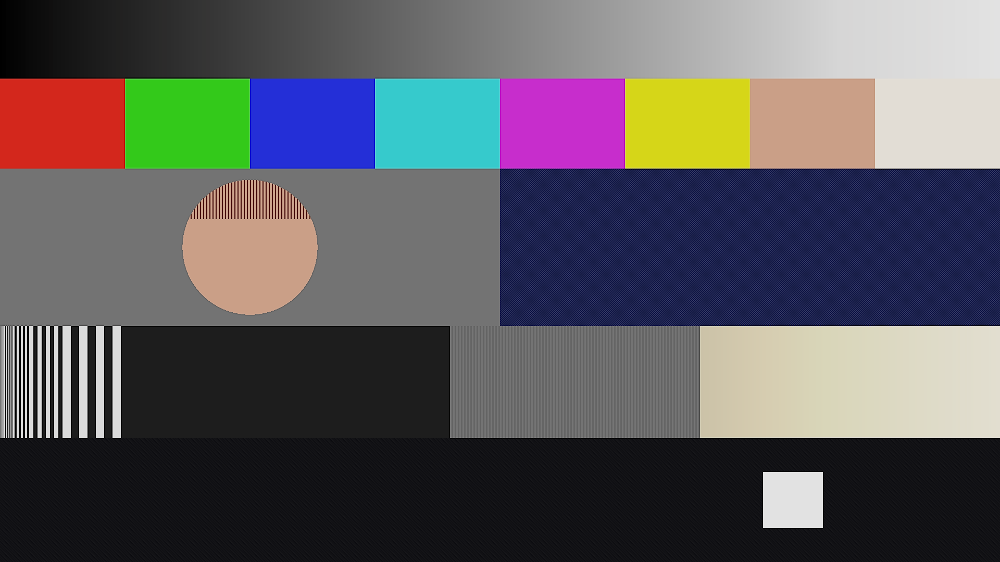
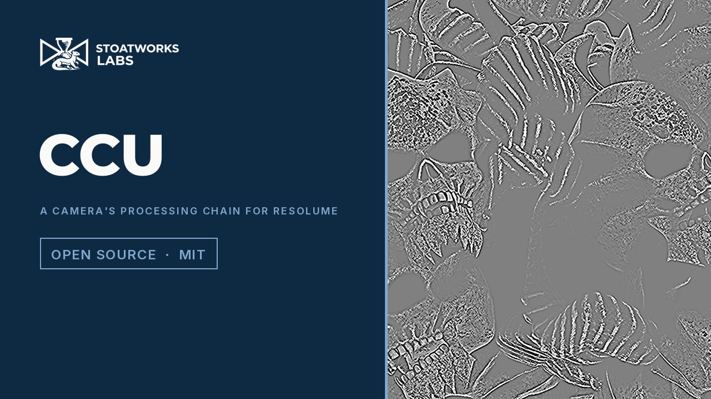

# ccu

> **AI-assisted project.** This codebase was created with [Claude](https://claude.com/claude-code)
> (Anthropic), directed and reviewed by a human author. The chain is not
> asserted but measured: an offline harness drives the real plugin class in a
> headless GL context and reads each claim back out of the picture it made —
> every stage at its null returns the input within a bound derived from the
> OETF round trip in float, alpha bitwise, and again after a resize; a step's
> overshoot is Detail Level × h / 4 for exactly the delay, whole and fractional,
> horizontal and vertical; an edge below Coring gets no detail and one above it
> gets the overshoot less the dead zone; above the knee point a linear ramp's
> slope is Knee Slope, continuous at the point, per channel; a ramp follows
> the OETF at three exponents and Black Gamma lifts only below its level; a
> warm white through white balance and then the knee compresses in red where
> the other order would clip it; the detail gain inside the skin window is
> 1 − Skin Detail and outside it is 1 — with a negative control per check that
> proves each can fail, and one recorded mutation of the shipped GLSL. It has
> **never been loaded into Resolume**. It is loaded by
> [oxbow](https://github.com/stoatworks-labs/oxbow), which is a real FFGL host
> and is not Resolume. See [Status](#status).

A broadcast camera's processing chain with every knob out, as an FFGL effect
for [Resolume](https://resolume.com) Arena and Avenue.



<sub>One frame, rendered by `cctest`, the offline harness — not captured from
Resolume. The defaults. The halos on the bars are the width of the detail
delay, not of the edge; the top of the ramp and the warm sky have gone through
the knee; the hair on the skin disc is softer than the weave on the jacket
because of the skin window; the floor's fine texture is left alone by the
coring.</sub>

[](https://www.youtube.com/watch?v=w5i91PWg-c4)

*[Watch it](https://www.youtube.com/watch?v=w5i91PWg-c4) — 62 seconds:
Detail Level from 0 to 3 and the delay from 2 to 9 pixels, the Show Detail
view with Coring eating the texture, Skin Detail dropping bone and orange out
of the view and the window moved to cyan, the knee on, off, gained into a hard
clip and back on, a warm white compressed and then clipped in red first, Gamma
and Black Gamma, the four matrix presets, pedestal and white clip. Every frame
is the real plugin's output: an FFGL plugin has no window, so the footage is
rendered by this repository's own offline harness (`cctest --pipe`, driven by
a cue sheet) over Resolume's bundled demo clips, not captured from Resolume.*

## The one idea

The "video" look of a studio or OB camera is not a filter. It is a
**processing chain in a fixed order**, each stage a known circuit with the
knob a shader on the CCU panel turned:

    linear light → white balance → matrix → detail → knee → gamma and black gamma → pedestal → white clip

Put the stages in the right order, in linear light, and label the knobs the
way a CCU labels them, and the badly set-up camera looks fall out rather
than being drawn:

- **Halos.** Detail boosts edges by adding a high-passed copy made from pixel
  and line delays, so a hard edge overshoots on one side and undershoots on
  the other, **for the width of the delay, not of the edge**.
- **Coring** keeps detail off the noise: small detail is not boosted at all,
  so a low coring sharpens the grain and a high one plastic-coats the picture.
- **Skin detail** suppresses detail inside a hue window, and faces go soft
  while the jacket stays sharp.
- **Knee.** Above the knee point highlights are compressed, so skies keep
  their colour. With the knee off they clip — and because the knee follows
  white balance, **a warm white clips in one channel first**.
- **Black gamma** lifts the shadows on a curve below its level and nowhere
  else.
- **Drifting white balance.** The R and B gains wander slowly, as a
  warming-up camera did.

Nothing carries across frames except the drift, a double on the CPU. The
chain is two GLSL passes and the constants — the OETF's, the matrix, the
drift's step — are computed in double once a frame.

## Controls

| Group | | |
| --- | --- | --- |
| **Exposure** | Master Gain | head-end gain, −6 to +18 dB, in linear light; 0 dB at a quarter |
| | Master Black | pedestal on video, −0.05 to +0.15; 0 at a quarter |
| | White Clip | 0.85 to 1.15; exactly 1 at the middle |
| **White** | R Gain, B Gain | ±6 dB about green; 0 dB at the middle |
| | Drift | a slow random walk in mireds, 20 s time constant, up to 60 mireds RMS |
| **Matrix** | Matrix | Identity, Standard (SMPTE-C to BT.709), High Saturation, Film-like |
| | Saturation | 0 to 2 about BT.709 luma; exactly 1 at the middle |
| **Detail** | Detail Level | the gain on the detail signal, 0 to 3; a step of h overshoots by Level × h / 4 |
| | Crispening Freq | the delay, 1 to 9 pixels; whole at every eighth |
| | H/V Ratio | vertical only at 0, horizontal only at 1, both at the middle |
| | Coring | the edge height below which there is no detail at all, 0 to 0.25 linear |
| | Level Dependence | how far detail is reduced in the shadows |
| | Skin Detail | the detail gain inside the skin window is 1 − this |
| | Skin Hue, Skin Width | the window's centre (0 to 360°) and half-width (5 to 60°) |
| **Knee** | Knee On | |
| | Knee Point | 0.4 to 1.0 in linear light |
| | Knee Slope | 0.05 to 1 above it; continuous at the point; per channel |
| **Gamma** | Gamma | the OETF's exponent, 0.35 to 0.55; BT.709's 0.45 at the middle |
| | Black Gamma | a lift below 0.25 video |
| **Output** | Mix | |
| | Show Detail | the detail signal about mid grey, for setting up |

Every numeric control is 0..1 to the host; the conversions above live in
`Controls.cpp`, written so each null is exact in binary. The parameter names
are at most 16 characters, which is why it is `Crispening Freq`.

## Status

**v0.1.0, released 2026-09-24, and honestly early.** Verified by
measurement on an M4 Max, macOS 26.4, at 320×180 and 1280×720, on a fresh
universal build. Never loaded into Resolume on macOS.

| Check | Result |
| --- | --- |
| `--identity` | every stage at its null returns a three-ramp picture to **1.19e-7**, 0.07 of a tolerance derived from the OETF round trip in float (3.57e-6 at white); alpha bitwise; the same after a resize mid-run |
| `--detail` | a step of 0.3872 linear overshoots by **0.096795** against Level × h / 4 = 0.096795 and undershoots by the same, for exactly ceil( delay ) pixels at 2, 2.5, 3 and 1.5 px; the fractional pixel carries f × the peak; the view matches the kernel to 1.5e-8 and the output the chain to 6.6e-8 |
| `--coring` | an edge of 0.02 below Coring 0.04: **exactly zero** both sides (uncored, 0.005); an edge of 0.20: **0.040000** against Level × ( h − c ) / 4 |
| `--knee` | a linear ramp above the point at **0.24000** against 0.2400, below it at 1.00000, no column stepping more than the ramp, per channel (R compressed, G and B untouched to 6e-8), and the identity with the knee off |
| `--gamma` | OETF( gL ) at +6 dB per column to 1.7e-7 with the linear segment exercised; exponents 0.35 and 0.55 to 1.7e-7; Black Gamma to 1.2e-7, lifting up to the last column its bump can be seen on and not from 0.25 |
| `--order` | red at +6 dB through white balance then the knee is **0.831815** as predicted; the knee-first order would give 0.997004, **34 605 tolerances** away; with the knee off red clips to **exactly 1.0** while green and blue sit at 0.9000 |
| `--skin` | detail gain **0.25** inside the window, **1.00** with the window 90° away, **1.00** on a neutral, to 2.7e-8 |
| `--negative` | eight perturbed chains — gamma space, the knee before white balance, no coring, a doubled kernel, a steeper knee, the skin window ignored, the exponent high — each **fails** its check at both rasters |
| mutation | one character of the shipped GLSL (the encode's `- OetfC` → `+ OetfC`) was caught by five checks at both rasters; the two that read the Show Detail view did not, as they should not; reverted |
| `tools/sweep.py` | all **23** controls measurably change the picture |
| shaders | all 3, as the plugin compiles them, through `glslc` |
| `--pipe` | 2.5 frames in, exactly 2 out; an unknown cue refused (2); a failed render and a closed stdout (`\| head -c 1`) each exit 1; a boolean cue steps and a slider cue ramps |
| the bundle | universal (`x86_64 arm64`), exports `plugMain`, ad-hoc signs; `oxbow` reports `SW CCU` / `CC01` / `effect` and renders 120 frames through `plugMain` |

Render cost, best of three runs of 60 frames after a warm-up, `glFinish`
both sides, on a GPU shared with other builds: **0.06 ms** at 720p, **0.17
ms** at 1080p, **0.68–0.70 ms** at 4K — 4% of a 60 fps frame at 4K. Two
passes and eight texel fetches a pixel. macOS figures only.

Seen on footage: nine of Resolume's bundled demo clips through `--pipe` at
the defaults, judged by eye beside the source — halos of the delay's width on
the bright edges, hot spots and white backgrounds compressed to a milky 90%,
the fine dark texture left alone by the coring. A hot broadcast camera, not a
broken one. Not measured.

### Not established

It has **never been loaded into Resolume on macOS**. Everything above was
compiled, rendered and measured offline against the real plugin class in a
headless CGL context, plus an `oxbow` load. How twenty-three controls in eight
groups read in Arena's inspector on macOS is untested. The drift has not been
watched over a minute in a host. On Windows, a CI build of this source loads, registers and renders in Resolume Arena 7.27.1 on software rendering (win-lab, Mesa llvmpipe, no GPU): all 29 host controls match the declaration and all 24 that take a value move the picture, 9 of the fleet gate's 9 checks (`plugin-bench/arena/expect/ccu.json`). Software rendering says nothing about a GPU or about speed. No OpenFX port. There is a
[user guide](https://stoatworks-labs.com/software/ccu/guide/) and a browser
demo at [ccu-demo.stoatworks-labs.com](https://ccu-demo.stoatworks-labs.com/),
which is a port of the shaders rather than the plugin.

### Found filming the release video

The video was rendered by `cctest --pipe` over Resolume's bundled demo clips,
after every one of the 33 was put through the defaults: nothing floods or
blanks, the dark clips stay dark, and the defaults stood. One claim was
corrected by the footage: a warm white with the knee off does not give
cyan-edged highlights. Red reaches the ceiling first, so each highlight's core
goes white inside a warm surround; with the knee on it stays warm all the way
up.

## Build

Needs CMake 3.15+, a C++17 compiler, and the FFGL SDK submodule.

```bash
git clone --recursive https://github.com/stoatworks-labs/ccu
cd ccu
cmake -B build -DCMAKE_BUILD_TYPE=Release
cmake --build build --parallel
cmake --install build     # into ~/Documents/Resolume Arena/Extra Effects
```

macOS builds are universal (Apple Silicon + Intel) by default; add
`-DCMAKE_OSX_ARCHITECTURES=arm64` for a faster dev build. Windows needs GLEW via vcpkg.

## Building and testing

The offline harness renders the real plugin class headlessly:

```bash
./build/cctest --out /tmp/frame.png --size 1920x1080   # the test card
./build/cctest --list                                  # every control, kind and default
./build/cctest --identity --detail --coring --knee --gamma --order --skin   # each claim, measured
./build/cctest --negative                              # and the checks can fail
./build/cctest --offline                               # what needs no GL (CI)
./build/cctest --bench                                 # 720p, 1080p and 4K
python3 tools/sweep.py                                 # no control is silently dead
tools/verify.sh                                        # all of it, on a fresh universal build
```

Every check takes `--size`; run it at 320×180 as well as the raster you care about.
Footage goes through the real shaders with `--pipe`, in the fleet's frame format:

```bash
ffmpeg -i in.mov -f rawvideo -pix_fmt rgba - \
  | ./build/cctest --pipe --size 1920x1080 --fps 50 --script cues.txt \
  | ffmpeg -f rawvideo -pix_fmt rgba -s 1920x1080 -r 50 -i - out.mov
```

See [`CLAUDE.md`](CLAUDE.md) for the full command reference and
[`AGENTS.md`](AGENTS.md) for the model, the traps, and where every tolerance
comes from.

<!-- attributions:start -->
This project is built on other people's work — see [ATTRIBUTIONS.md](ATTRIBUTIONS.md).
<!-- attributions:end -->

## Licence

MIT — see [LICENSE](LICENSE).
